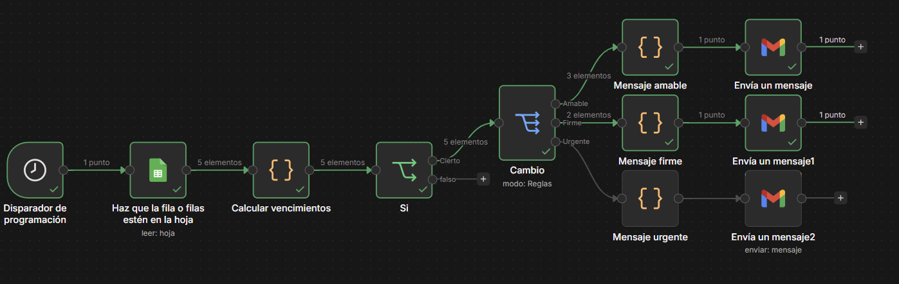
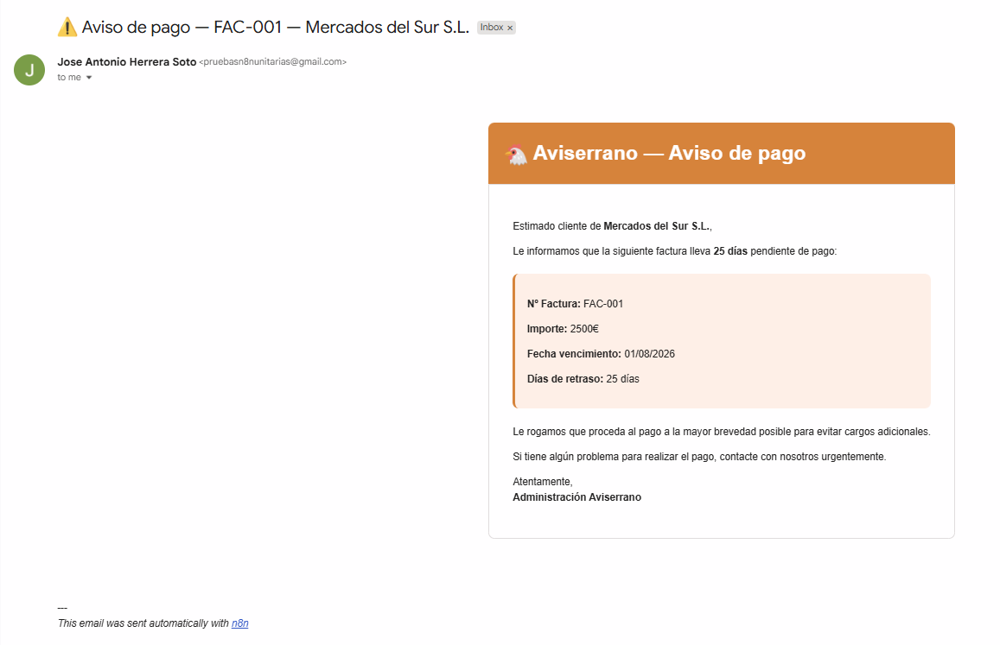

# 💰 Recordatorios Automáticos de Cobros Vencidos — n8n Workflow

> Automatización de gestión de cobros para empresas con facturas pendientes de pago.

---

## ¿Qué hace este workflow?

Cada mañana a las **9:00 AM**, sin intervención humana, el sistema:

1. Lee todas las facturas con estado **"pendiente"** desde Google Sheets
2. Calcula los **días de retraso** de cada factura
3. Clasifica el aviso según la gravedad del retraso
4. Envía un **email personalizado** a cada cliente con el tono adecuado

**Resultado:** Los clientes con facturas vencidas reciben automáticamente un recordatorio de pago cada día, con un mensaje más serio cuanto más días llevan sin pagar — sin que nadie lo redacte ni envíe manualmente.

---

## Lógica de clasificación

| Días de retraso | Tipo de aviso | Tono |
|---|---|---|
| Menos de 15 días | 🟢 Amable | Recordatorio cordial |
| Entre 15 y 30 días | 🟠 Firme | Aviso formal |
| Más de 30 días | 🔴 Urgente | Requerimiento urgente |

Cada tipo genera un email diferente en contenido, color y nivel de urgencia.

---

## Problema que resuelve

El seguimiento manual de facturas impagadas consume tiempo del equipo de administración y a menudo se olvida. Este workflow garantiza que ninguna factura vencida quede sin reclamar, aumentando la tasa de cobro sin esfuerzo manual.

---

## Stack técnico

| Herramienta | Uso |
|---|---|
| **n8n** | Motor de automatización |
| **Google Sheets** | Fuente de datos (facturas pendientes) |
| **Gmail** | Envío de recordatorios |
| **Code nodes (JS)** | Cálculo de días de retraso y clasificación |
| **Switch node** | Lógica de ramificación por gravedad |

---

## Nodos del workflow

```
Disparador programado (9:00 AM)
  └── Google Sheets → leer facturas pendientes
        └── Calcular días de retraso (Code)
              └── IF → ¿tiene retraso?
                    └── Switch → clasificar por gravedad
                          ├── Amable (<15 días)
                          │     └── Generar HTML mensaje amable
                          │           └── Gmail → enviar
                          ├── Firme (15-30 días)
                          │     └── Generar HTML mensaje firme
                          │           └── Gmail → enviar
                          └── Urgente (>30 días)
                                └── Generar HTML mensaje urgente
                                      └── Gmail → enviar
```

**Total: ~11 nodos**

---

## Capturas

### Workflow completo


### Email generado automáticamente


---

## Ejemplo de email generado

El sistema genera emails HTML con formato profesional incluyendo:
- Nombre del cliente
- Número de factura
- Importe pendiente
- Fecha de vencimiento
- Días de retraso
- Mensaje adaptado al nivel de urgencia

---

## Cómo usar

1. Importa `workflow.json` en tu instancia de n8n
2. Conecta tus credenciales de Google Sheets y Gmail
3. Adapta la hoja de cálculo con tus facturas pendientes
4. Configura los umbrales de días según tu política de cobros
5. Activa el workflow

---

## Autor

**Josan Herrera** · Desarrollador DAM & Especialista en IA y Automatizaciones  
📧 hjosanherrera@gmail.com  
🔗 [GitHub](https://github.com/JosanHerrera) · [LinkedIn](https://www.linkedin.com/in/jose-antonio-herrera-soto-3b5980246/)

---

*Desarrollado como parte del proyecto de automatización administrativa para PYMEs.*
